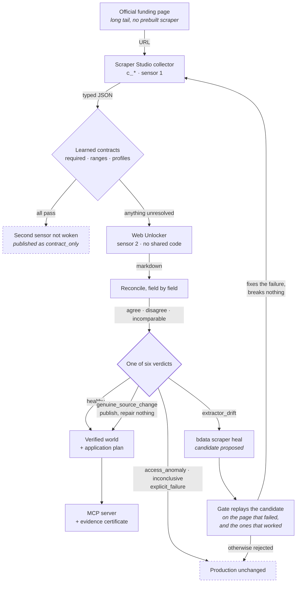

# Doorway

**Doorway finds scholarships, fellowships and grants for students, and reads every important fact twice before showing it to anyone.**

A scraper that breaks loudly is easy to notice. The one that matters keeps working, keeps returning valid data, and returns the wrong date. Doorway catches that, and refuses to publish what it cannot confirm.

**Live:** [doorway-frontend-snowy.vercel.app](https://doorway-frontend-snowy.vercel.app)
**Break it yourself:** [/proof](https://doorway-frontend-snowy.vercel.app/proof) · **Check a certificate:** [/verify](https://doorway-frontend-snowy.vercel.app/verify)

Built for **Into the Scrape-Verse** on Bright Data Scraper Studio, Web Unlocker and the `bdata` CLI.

---

## The problem

A student searching for funding needs one thing to be right: the closing date.

Funding pages make that hard. A single page often carries four dates, and only one of them is the deadline:

```
Early interest deadline      1 September 2026
Application deadline        18 September 2026
Notification                15 October 2026
Programme starts             5 January 2027
```

A scraper told "get the deadline" takes whichever comes first in the page. It returns `1 September 2026`. That value is a real date, in the right format, in the right field. Nothing errors. No monitor alerts. A student reads it, assumes applications closed, and never comes back. They had seventeen more days.

This is the failure that matters, and almost nothing catches it:

- **A schema check passes.** The value is a valid date.
- **A null check passes.** The field is not empty.
- **An error rate stays flat.** The request succeeded.
- **Self-healing does not fire.** Nothing looks broken.

Everything downstream inherits a confident wrong answer, silently, for months.

[The longer version, with the real pages it came from →](docs/THE-PROBLEM.md)

---

## What this demonstrates

Four things, each with somewhere you can go and check it.

### 1. The scraper, designed in Scraper Studio

Six collectors against long-tail funding pages, each built from a
natural-language brief through the CLI. What makes them a design rather than a
receipt is the **field contract** attached to every one:

```json
{
  "path": "deadline_raw",
  "meaning": "The date applications close, not a notification or results date",
  "labels": ["application deadline", "applications close"],
  "excludeLabels": ["early interest", "notification", "result"],
  "shape": "date"
}
```

And a rule enforced when a collector is registered: **a protected field must be
read by a second sensor.** Protecting a field is a statement that publishing it
wrong does harm, so it cannot be one only a single sensor sees. Registration
refuses the arrangement outright.

*Check it:* any collector page on `/engine` shows its contract and how it was
built. → [How each collector was built](docs/SCRAPER-STUDIO.md)

### 2. Driven from a coding agent

Not "an agent wrote this last week". The product calls Scraper Studio at
runtime when it meets a page it has no sensor for.

Paste any funding page into the Foundry on `/engine` and watch: the page is
read through Web Unlocker first, the agent reports the dates it found, says
**which label it refuses to take the date from**, writes the brief, and creates
the collector. Measured at 97 and 116 seconds on real pages.

```
saw   2 labelled dates on the page
saw   "1 September 2026" is labelled early interest, not the closing date
saw   "18 September 2026" is labelled application deadline
brief Extract the title, provider, funding level and closing date.
      Take the closing date from "application deadline".
      Never take it from "early interest".
```

The refusal is the half that matters. A brief naming only what to extract
produces a scraper that takes the first plausible date in the page.

*Check it:* [/engine](https://doorway-frontend-snowy.vercel.app/engine), with a URL we have never seen.

### 3. What it did when the site changed

Six verdicts, not a pass/fail, because "the page changed" and "the extractor
broke" need opposite responses. Every fault on `/proof` states the verdict a
correct system should reach **before** you run it, so the demonstration can
fail in front of you.

The case worth watching is `genuine_source_change`: a source that genuinely
moved its deadline is published, and **nothing is repaired**. Repairing a
collector that was right is how a working one gets broken.

When a repair *is* warranted, it has to earn promotion. A proposed fix is
replayed against the page that failed and the pages that were working, and
rejected unless it fixes the first without breaking the second. That gate has
already caught a real repair that reported success: Self-Healing completed,
passed its own validator, and the field it was asked to fix still returned the
wrong value.

*Check it:* [/proof](https://doorway-frontend-snowy.vercel.app/proof), break the page yourself.

### 4. What the structured output went on to power

Three things, and none of them is a dashboard.

**An application plan** that changes when the source does. When both sensors
agree a programme has added a required document, the plan gets harder and says
so. When only the collector claims a requirement vanished, the requirement
**stays on the list**, because a checklist that quietly shrinks when an
extractor slips is worse than no checklist.

**An MCP server** that refuses. An agent asking for a disputed fact gets the
field named and an instruction not to scrape around the refusal, rather than a
confident wrong answer at the moment one does the most damage.

**Evidence certificates** anyone can re-derive in their own browser, with no
call back to us, because a verifier that asks our server whether our own
document is valid proves nothing.

*Check it:* open any opportunity, then [/verify](https://doorway-frontend-snowy.vercel.app/verify).

---

## What Doorway does about it

Every important fact is read **twice, by two things that share no code**:

1. A **Scraper Studio collector** built from a natural-language brief, returning typed JSON.
2. **Web Unlocker**, reading the same page as markdown, extracting independently.

Then it compares them, and reaches one of six conclusions:

| Verdict | What it means | What happens |
|---|---|---|
| `healthy` | Both read the same values | Publish |
| `genuine_source_change` | Both read the same **new** value | Publish, and repair nothing |
| `extractor_drift` | They disagree | Withhold the field, repair the collector |
| `access_anomaly` | They were served different pages | Withhold, blame neither |
| `inconclusive` | Too little could be compared | Withhold |
| `explicit_failure` | The run itself failed | Withhold |

**The second row is the one that matters.** Most self-healing repairs whenever output changes. If a foundation genuinely moves its deadline and you "fix" the scraper, you have broken a scraper that was working perfectly. Doorway proves the change is real before deciding whether anything is broken.

---

## Demo

Nothing below needs an account. The first two run offline.

```bash
npm install && npm test      # 655 tests, no network, no credentials
npm run blindspot:proof      # replays the blind spot this system was built around
```

`blindspot:proof` reproduces, with no network call, the failure that shaped the design: a page whose apply button was removed, a collector that kept reporting the old link, and every sensor agreeing because none of them was watching that field. It prints the run before the fix and after it.

**On the live site, in about two minutes:**

1. **[/proof](https://doorway-frontend-snowy.vercel.app/proof)** hands you the fault switch. Four faults, each stating the verdict a correct system should reach **before** you run it, so the demonstration can fail in front of you.
2. **[/engine](https://doorway-frontend-snowy.vercel.app/engine)** has the Foundry. Paste any public funding page and watch a Scraper Studio collector get built for it: the agent reads the page, names the dates it found, says which one it refuses to use, then writes the brief. About two minutes.
3. **The home page** turns verified records into a personalised list, and any opportunity opens into an application plan.
4. **[/verify](https://doorway-frontend-snowy.vercel.app/verify)** re-derives an evidence certificate in your own browser, with no network call.

---

## Does it work?

### Evaluation

The question is not "does the scraper run". It is **can this tell a broken extractor from a changed page**, because treating one as the other is how a working collector gets destroyed.

The Drift Discrimination Score measures exactly that, over a corpus of injected faults with known correct answers.

```bash
npm run benchmark
```

[Full method and results →](docs/EVALUATION.md)

**Measured live**, all five faults reaching the verdict `/proof` promises in advance:

| Fault injected | Verdict reached | Published? |
|---|---|---|
| Early-interest date added above the real one | `extractor_drift` | withheld |
| Deadline genuinely extended | `healthy` | published, no repair |
| Sponsored listing inserted above | `healthy` | published |
| Apply link removed | `genuine_source_change` | withheld |
| Nothing changed | `healthy` | published |

### Testing

**655 tests, no network and no credentials required.** Verified by deleting `.env` and running the suite.

```bash
npm test
```

They cover detection, classification, the repair gate, the API surface, and an offline end-to-end run of the whole loop. What they do **not** cover is worker restart mid-repair and duplicate job claims. That gap is real and named in [Known issues](#known-issues).

### Monitoring

Every run is recorded with what each sensor read and the line it read it from. Incidents are exportable as evidence certificates: a SHA-256 digest over the verdict, both readings and their sources, re-derivable in a browser.

**Honest limit, stated on `/verify` too:** this detects editing, not forgery. It is a digest, not a signature, so it proves the document is unaltered rather than proving who issued it.

`GET /api/budget` reports page loads spent on scheduled monitoring, and says so, because it does not count crawls or live searches.

---

## Run it yourself

### Quickstart

Requires **Node 22+**. No account needed for the tests.

```bash
git clone https://github.com/RajdeepKushwaha5/Doorway.git
cd Doorway
npm install
npm test                     # 655 tests, offline
```

To run the whole thing locally against Bright Data:

```bash
cp .env.example .env         # then fill in the values below
npm run dev                  # API, dashboard and fixture together
```

- Dashboard: `http://localhost:3000`
- API: `http://localhost:4000`
- Fixture: `http://localhost:3002`

### Configuration

| Variable | Required | What it does |
|---|---|---|
| `BRIGHTDATA_API_KEY` | for live runs | Your Bright Data key |
| `BRIGHTDATA_UNLOCKER_ZONE` | for live runs | Web Unlocker zone name. Without it the second sensor cannot run |
| `NOTICE_ADMIN_TOKEN` | to change anything | Mutating routes are **disabled entirely** when unset, rather than defaulting to open |
| `DRIFTMART_ADMIN_TOKEN` | for the fault switch | Guards the fixture's mode switch |
| `NOTICE_CORS_ORIGIN` | when deployed | The dashboard's origin |
| `NOTICE_WARM_ON_BOOT` | optional | Rebuild the world on a cold start. Costs 2 requests per collector |

Secrets live in `.env`, which is gitignored. No token value appears in any tracked file.

### Deployment

The API and the fixture run on **Render** from `render.yaml`; the dashboard runs on **Vercel**. All three are free plans.

[Step-by-step deployment →](docs/DEPLOY.md)

---

## How it works



**Note the left branch.** When every contract passes there is nothing for a second reading to settle, so it is not taken, and the record is published marked `contract_only` rather than claiming corroboration it does not have.

### The collectors

Every one was created from a sentence, through the CLI, not by hand:

```bash
bdata scraper create \
  "https://doorway-lab.onrender.com/opportunity/ai-fellowship" \
  "Extract the opportunity title, the provider, the funding level, and the date
   applications close. Take the closing date from the label 'Application
   deadline'. Never take it from 'Early interest deadline'."
```

**The refusal is the half that matters.** A brief naming only what to extract produces a scraper that takes the first plausible date in the page.

| Collector | Watches |
|---|---|
| `c_mt3uuz5c3gmgatqsn` | cprgindia.org |
| `c_mt3s9p6m112ldkx8mh` | research.adobe.com |
| `c_mt44fc4f2loq3t8phs` | latrobe.edu.au |
| `c_mt44l71t10f3gdtrs7` | wemakedevs.org |
| `c_mt44nnhx3cd5t6wy1` | devpost.com |
| `c_mt36mo6tj37dmjgqh` | the controlled fixture |

[How each was built and what it extracts →](docs/SCRAPER-STUDIO.md)

### What this scrapes, and what it does not

Every source is a public page that returns 200 to an anonymous request. **No login walls, no paywalls, no personal data.** These are long-tail targets on purpose: none is covered by Bright Data's prebuilt library, and none has an API that would make scraping it a strange choice. The records describe programmes, not people.

The fixture is ours and says so on the page and in every record it produces. It exists because no real foundation will corrupt its own deadline on cue.

### Project structure

```
backend/
  src/brightdata/    Scraper Studio, Web Unlocker and Self-Healing clients
  src/witness/       The second sensor: extraction and comparison
  src/contracts/     Learned baselines and invariant checks
  src/incident/      Classification into six verdicts, and the repair gate
  src/pipeline/      observe, repair, manufacture a new collector
  src/crawl/         Crawler, frontier and the opportunity index
  src/doorway/       Matching, lifecycle, application plans
  src/mcp/           MCP server for AI agents
frontend/            Next.js dashboard
driftmart/           The controlled fixture, with its fault switch
docs/                Deployment, evaluation, findings
```

---

## Decisions worth knowing

**Two sensors instead of a better parser.** A cleverer extractor still has one opinion. Two independent readings can disagree, and the disagreement is the signal. The cost is one extra page fetch per verified fact.

**Six verdicts instead of pass/fail.** Because "the page changed" and "the extractor broke" need opposite responses, and a binary check cannot tell them apart.

**A repair must earn promotion.** A proposed fix is replayed against the page that failed **and** the pages that were working, and rejected unless it fixes the first without breaking the second. This is not theoretical: Bright Data's Self-Healing once reported a repair complete, passed its own validator, and the field it was asked to fix still returned the wrong value. The gate caught it and left production alone.

**Refuse rather than guess.** When the two sensors disagree, the API returns the last value both confirmed and names the disputed field. The MCP server refuses outright and tells the agent not to scrape around the refusal. A confident answer is at its most damaging exactly when the value is in doubt.

[Everything we found building against the platform →](docs/PLATFORM-FINDINGS.md)

---

## Use it from an AI agent

```bash
claude mcp add notice -- npm run mcp
```

An agent gets verified values with their evidence, or a refusal naming the disputed field:

```
REFUSED. NOTICE will not vouch for data from Doorway Lab right now.
reason   extractor_drift
fields   deadline_raw
Do not substitute a guess or scrape this page directly to work around this.
```

---

## Known issues

Recorded rather than hidden, because a project arguing for honest reporting of data quality should report its own.

**The free-tier store does not survive a restart.** Render's free plan has no persistent disk, so a redeploy or a spin-down after fifteen minutes idle clears runs, incidents and verified snapshots. `NOTICE_WARM_ON_BOOT=true` rebuilds the world automatically on boot. What it does not rebuild is the crawl index, because that is hundreds of page loads rather than twelve.

**The worker's orchestration has no dedicated tests.** Ticking, job claiming and scheduling are exercised incidentally by the pipeline suites rather than directly. Worker restart mid-repair and duplicate job claims are not covered at all.

**Three high-severity advisories reach us through Next.js.** `postcss` and `sharp` as transitive dependencies of `next@15`. `sharp` is the image optimiser and this dashboard never invokes it. The fix is a Next major bump.

**The crawl index goes stale.** Nothing re-crawls on a schedule yet.

---

## Built with

Bright Data Scraper Studio · Web Unlocker · `bdata` CLI · Node 22 · TypeScript · Next.js · Vitest

AI coding tools assisted the implementation. Every architecture decision, platform finding and trade-off recorded here was reviewed and is explainable by the author, and the 655 tests are the check on all of it.

## License

MIT
